# Your first forecast in the Modeling App

A walk from a fresh deployment to an evaluated model and a three-month dengue
forecast, by clicking in the Modeling App. It takes about fifteen minutes, most
of it waiting for the model. It starts where
[Chap with a local DHIS2](./use-cases/chap-with-local-dhis2.md) ends:

```sh
varde init mychap --models default --with dhis2
cd mychap
varde up
varde status          # until the dhis2 line says up
varde dhis2 connect
varde open dhis2
```

`varde dhis2 connect` installs the Modeling App and runs the DHIS2 analytics
tables; it took less than a minute. Its last line is
`` the Modeling App can reach Chap; open DHIS2 with `varde open dhis2` ``.

Tested with Modeling App 7.2.0, DHIS2 2.42.6 with the Laos demo database,
chap-core v2.4.0 and CHAP-EWARS (chapkit) 1.0.4. Other versions of the Modeling
App may name a button differently; the steps stay the same. `varde dhis2 show`
says which Modeling App version a deployment has.

## What the demo data holds

The DHIS2 that `varde` starts is seeded with a demo database from Laos:

| Data | Where it is in DHIS2 | Range |
| --- | --- | --- |
| Dengue cases | `Dengue Cases (Any) - Weekly` | 2019 to 2024, weekly |
| Rainfall | `CCH - Precipitation (CHIRPS)` | 2015 to April 2025 |
| Temperature | `CCH - Air temperature (ERA5-Land)` | 2015 to April 2025 |
| Population | `LSB: Population (Estimated-single age)` | 2016 to 2025, yearly |

for Lao PDR, its 18 provinces and their districts. The Modeling App adds the
weekly cases up to months when an evaluation is monthly.

## 1. Open the Modeling App

Log in to DHIS2 with `admin` / `district`, open the app menu (the grid of
squares at the top right), type `Modeling` in its search box and pick
**Modeling**: the menu shows only a few top apps until you search. The
dashboard is empty until the first evaluation.

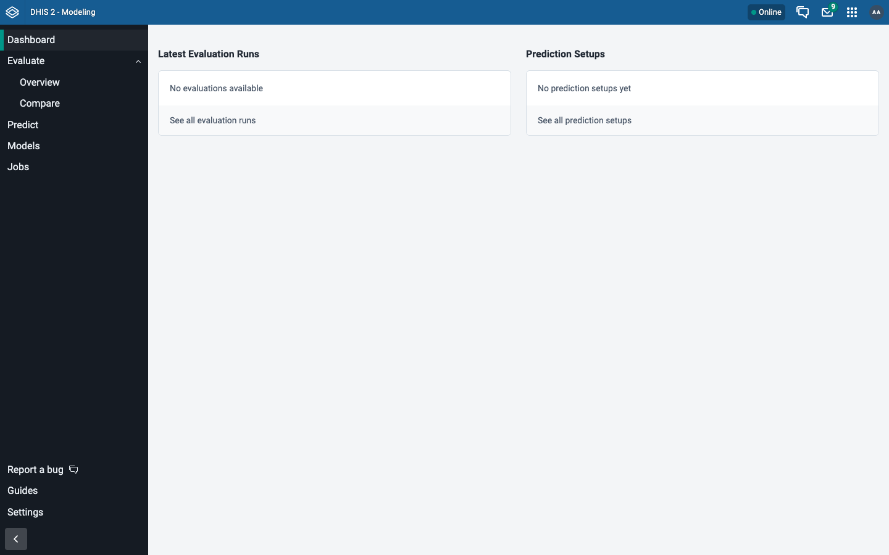

## 2. Start an evaluation

An evaluation asks: had this model been used in the past, how close would its
forecasts have come? It trains the model on the earlier data, forecasts the
months after, and compares the forecast with what really happened, several
times over.

In **Evaluate**, **Overview**, choose **New evaluation**. The page opens on the
tab **Use saved dataset**, which needs a dataset saved before. Choose the tab
**Import from DHIS2** and fill in:

| Field | Value |
| --- | --- |
| Name | anything, for example `EWARS Laos dengue` |
| Period type | Monthly |
| From period / To period | 2019 January to 2024 December |
| Organisation units | tick **Lao PDR**, pick the level **Province** below the tree, then **Confirm Selection** |
| Model | **CHAP-EWARS Model (chapkit) [Monthly climate]**, then **Use this model** |

Leave the **Backtest parameters** as they are: 3 forecast periods, 7 splits, a
step of 1, 1 training run, and the future-weather provider *Seasonal
climatology*.

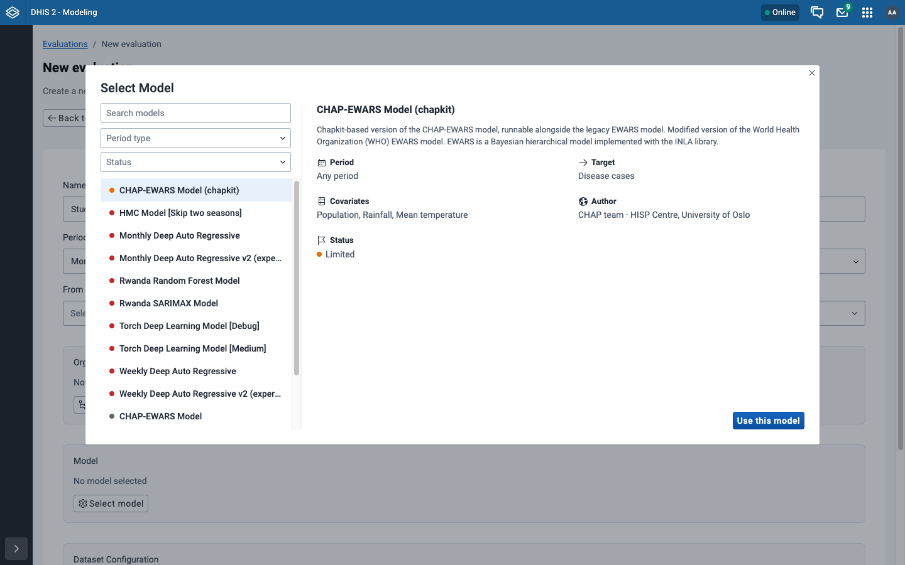

**CHAP-EWARS Model (chapkit)** is the model `varde` started with `--models
default`. It has three entries, one for each configuration in its marketplace
entry: *Monthly climate* uses rainfall and temperature, *Monthly population
only* uses no climate data, and *Monthly region seasonal* fits a season for
each province. Each model enabled with `varde models enable` adds its own
entries. `varde status` lists those models, and `varde models test` checks
them.

The list also holds models that chap-core ships configured on its own and runs
inside its worker. Some of them have the status *Deprecated*. One of those is
**CHAP-EWARS Model** without `(chapkit)`: it is the older EWARS, not the model
`varde` started.

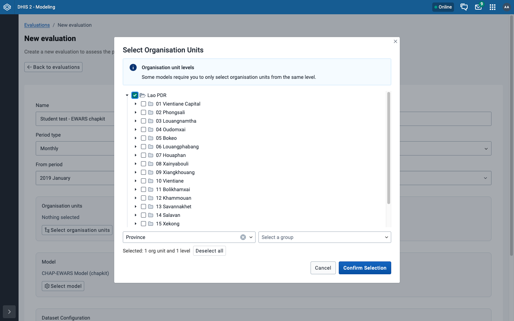

## 3. Map the data

**Configure sources** asks which DHIS2 data each input of the model comes from.
Search by name in each box:

| Model input | DHIS2 data item |
| --- | --- |
| Disease cases | `Dengue Cases (Any) - Weekly` |
| Population | `LSB: Population (Estimated-single age)` |
| Rainfall | `CCH - Precipitation (CHIRPS)` |
| Mean temperature | `CCH - Air temperature (ERA5-Land)` |

A search for the dengue cases also finds the items
`CHAP Dengue Cases (Any) - Weekly Quantile ...`. Those hold forecasts, not
cases; pick the item without `CHAP` in front.

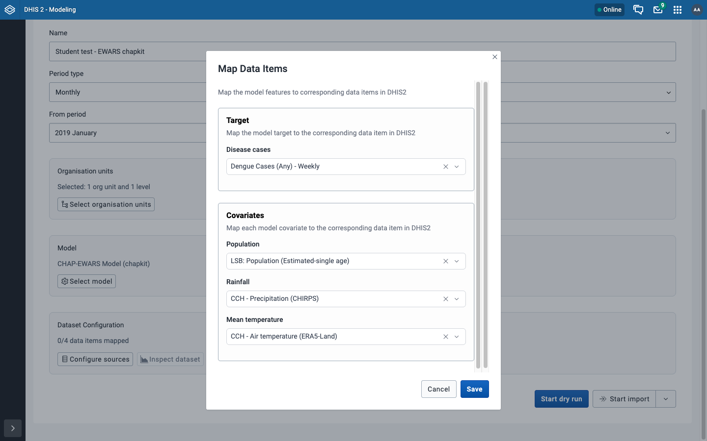

**Save**, then **Start dry run**. It checks the data without starting
anything, and should say *All 18 locations can be successfully imported*.

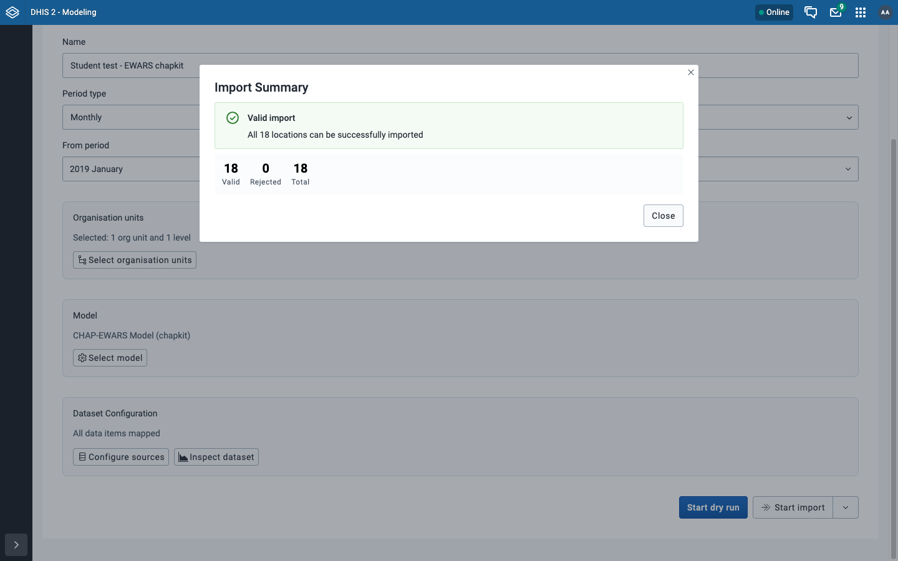

Close it and choose **Start import**. The app moves to **Jobs**, where the
evaluation runs. With CHAP-EWARS it took about two minutes on an Apple Silicon
Mac (M2 Max), where the model runs under emulation. `varde jobs` in the
terminal shows the same job; its type is `create_backtest_from_data`.

## 4. Read the result

Back in **Evaluate**, **Overview**, open the evaluation. The chart shows the
real cases (orange) and, for the period picked under **Split period**, the
model's forecast with its 50% and 80% prediction intervals. The list on the left
switches between all of Laos and one province.

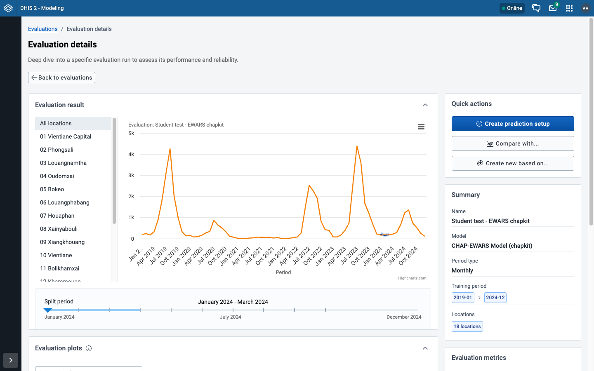

**Evaluation metrics**, lower on the right, scores the forecasts over every
split and province: lower is better for *CRPS (log1p)*, *MAE* and *RMSE*, and
*Coverage 10-90* should be close to its target of 0.8 (80% of the real values
inside the 80% interval). **Show all 13 metrics** lists the others.

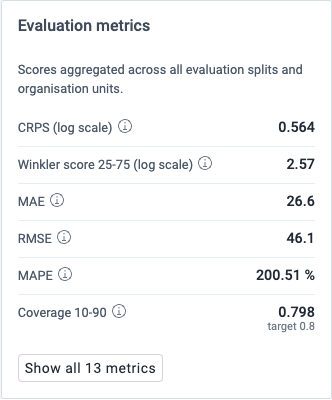

To compare two models, run a second evaluation on the same data:

1. On the first evaluation, choose **Create new based on...**. It asks which
   settings to copy; leave them all ticked and choose **Create**.
2. The copy has the name, provinces, model, data mapping and periods of the
   first, and its name ends in `(Copy)`.
3. On the copy, **Select model** picks another model. Then choose **Start
   import**.
4. In **Evaluate**, **Compare**, pick the first evaluation in the left box and
   the copy in the box beside it.

The *Monthly CHAP-EWARS model* that chap-core ships took about two minutes as
well. The comparison shows the two side by side, province by province; the box
**Location(s)** starts with ten provinces selected. More marketplace models
come with `varde models enable ID` and `varde up` (`varde models list` shows
the ids).

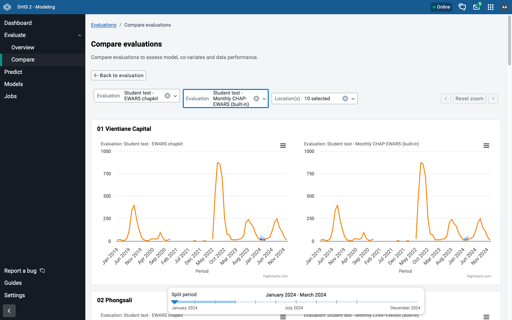

## 5. Make a forecast

On the evaluation, **Create prediction setup** keeps the model, the data
mapping and the provinces under a name: type one in **Setup name**, leave
**Set default import mapping** off and **Save**. The app then opens the setup.
Once the evaluation has a setup, the same button says **Predict**.

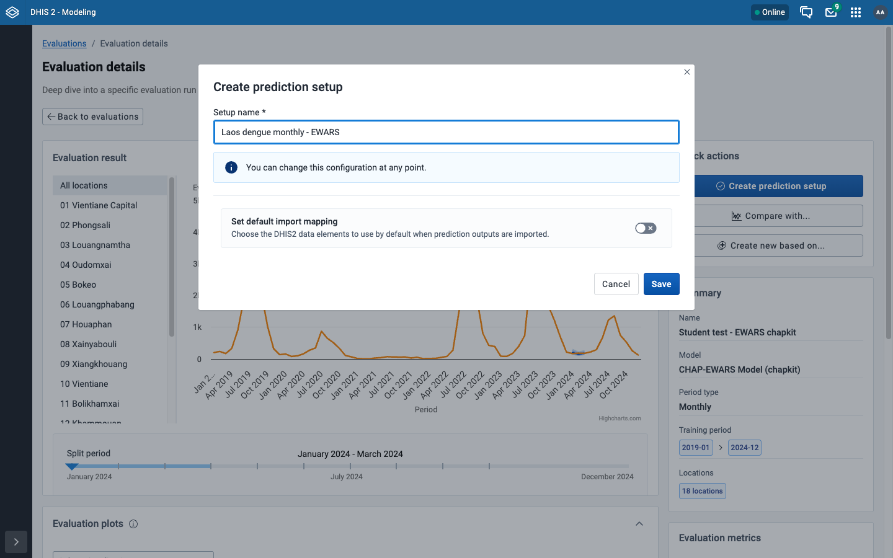

On the setup, choose **Run prediction**. The page fills in a name for the
run. In **Training period**, set the last training period to the last month
with case data: **2024 December** for the demo data. Then choose **Run
prediction** again. The forecast covers the three months after that month.

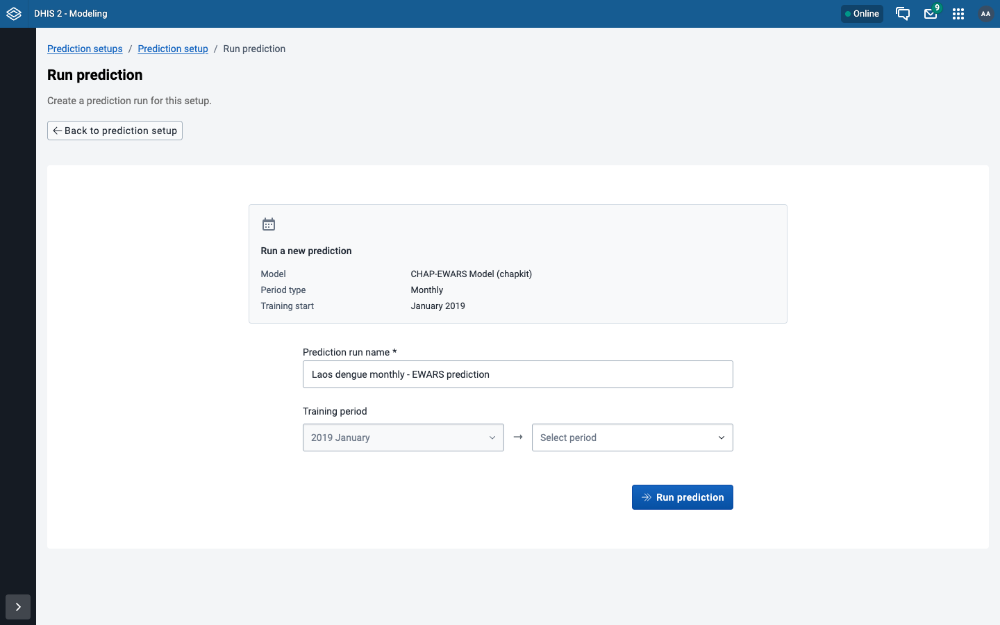

It took about twenty seconds. **Go to last run** shows one chart per province:
the real cases up to December 2024 and the forecast for January to March 2025.

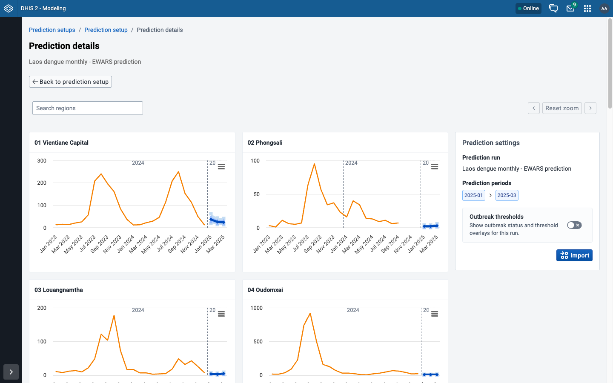

**Import**, on the right of the forecast, writes the forecast back into DHIS2
as data, where dashboards and maps can use it. It needs five data elements for
the forecast's quantiles. The page suggests the ones the demo database has,
`CHAP Dengue Cases (Any) - Weekly Quantile High` to `... Quantile Low`, and
**Clear and import** asks once more before it writes. DHIS2 2.42.6 accepted
the monthly values into those elements, but their data set is weekly. For a
monthly forecast, create monthly data elements in DHIS2's Maintenance app and
pick those.

## When something goes wrong

| What you see | What to do |
| --- | --- |
| Typing `Modeling` in the app menu finds nothing | `varde dhis2 connect` has not run, or failed; run it and read its last line. |
| The model list does not have the model `varde` enabled | `varde status`: the model must be `registered`. If it is not, the line under the table says why. |
| `Oops! Sorry, an unexpected error`, or `Unnamed evaluation` rows, after the deployment was recreated | The browser holds a login to the DHIS2 that was removed: open DHIS2 again and log in. See [Troubleshooting](./troubleshooting.md#oops-sorry-an-unexpected-error-or-unnamed-evaluation-in-the-modeling-app). |
| A job in **Jobs** says it failed | `varde jobs`, then `varde jobs logs ID` with the id it prints: the model's own error is at the end. |

More on connecting DHIS2 and Chap: [DHIS2](./dhis2.md). The Modeling App's own
guide is at
[chap.dhis2.org](https://chap.dhis2.org/chap-modeling-platform/modeling-app/).
